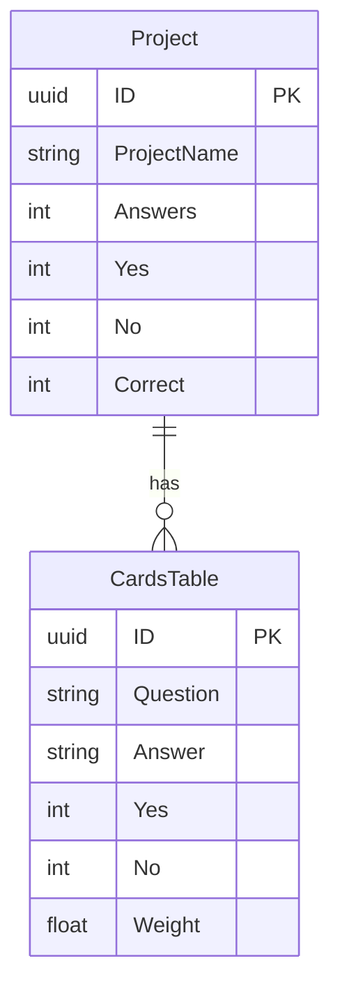

# Flashcard Application Backend Documentation
## Overview
This documentation covers the backend of the Flashcard Web Application, built using NestJS. The backend provides functionality for managing flashcards within projects, tracking learning progress, and collecting data on user interactions for enhanced learning experiences.

## Key Features
Project Management: Users can create and manage multiple projects. Each project can contain multiple flashcards.
- **Flashcard Management:** Each flashcard within a project consists of a question and an answer.
- **Learning Experience:** Users can mark their answers to flashcards as "yes" or "no," which assigns a weight to each response, enhancing the learning process.
- **Statistics Tracking:** The application tracks statistics, including how many flashcards have been learned and the distribution of "yes" and "no" responses.

# Architecture Overview
The backend of the Flashcard Web Application is built using the NestJS framework, which provides a robust structure for creating scalable and maintainable server-side applications. This backend handles all API communications and interacts with a PostgreSQL database to manage and store data.

## Core Components

**NestJS Framework:** 

Used for creating and managing the server-side application, including defining the APIs and handling communication between the frontend and the database.

**PostgreSQL Database:**

Serves as the persistent storage for all application data, including projects, flashcards, user responses, and learning statistics.

### NestJS Modules
The application is organized into several modules, each responsible for a specific aspect of the application’s functionality:

**Project Module:**

Purpose: Manages the creation, updating, and deletion of projects within the application.
Responsibilities:
Creating new projects.
Retrieving project details.
Handling associations between projects and flashcards.

**Flashcard Module:**

Purpose: Handles the CRUD (Create, Read, Update, Delete) operations for flashcards within a project.
Responsibilities:
Adding new flashcards to a project.
Updating existing flashcards.
Deleting flashcards.
Retrieving flashcards associated with a specific project.

**Learning Module:**

Purpose: Tracks user interactions with flashcards, specifically recording the answers provided during learning sessions.
Responsibilities:
Recording user responses to flashcards (e.g., marking a flashcard as answered with "yes" or "no").
Updating the learning status of flashcards.
Managing the logic for calculating learning progress and assigning weights based on responses.

**Statistics Module:**

Purpose: Aggregates and manages data related to user performance, providing insights into learning outcomes.
Responsibilities:
Tracking the number of flashcards learned within each project.
Collecting and summarizing the distribution of "yes" and "no" responses.
Providing endpoints for retrieving statistical data, allowing users to view their learning progress.

# Database Design
The backend uses PostgreSQL as the relational database to store and manage all application data. Below is the detailed schema for the database, which includes the Project and CardsTable tables.

## Database Tables

**1. Project Table**
This table represents a project, which is a collection of flashcards. Each project can have multiple associated flashcards.

**Fields:**
- ID (UUID, Primary Key): A unique identifier for each project.
- ProjectName (String): The name of the project.
CardsTable Connection (Foreign Key): Links to the CardsTable to associate flashcards with the project.
- Answers (Integer): Tracks the total number of answers recorded for the project.
- Yes (Integer): Counts the number of "yes" answers given within the project.
- No (Integer): Counts the number of "no" answers given within the project.
- Correct (Integer): A derived value or a metric indicating how many answers were correct, based on business logic.

**2. CardsTable**
This table contains all the flashcards associated with various projects.

**Fields:**
- ID (UUID, Primary Key): A unique identifier for each flashcard.
- Question (String): The question posed by the flashcard.
- Answer (String): The correct answer to the question.
- Yes (Integer): Tracks the number of times the correct answer ("yes") has been given.
- No (Integer): Tracks the number of times the incorrect answer ("no") has been given.
- Weight (Float or Integer): A calculated value that reflects the difficulty or importance of the flashcard based on the answers given, influencing its repetition or priority in learning sessions.

### Entity-Relationship Diagram (ERD)
Below is a visual representation of how these tables relate to each other:

## Data Flow in the Database
#### Creating a New Project
A new entry is added to the Project table with the necessary project details.
#### Adding Flashcards: 
Flashcards are added to the CardsTable, each linked to a specific project via a foreign key.

#### Tracking Answers
 As users interact with flashcards, their answers ("yes" or "no") are recorded in the CardsTable. These values aggregate at the project level, updating the Yes, No, and Correct counts in the Project table.

#### Calculating Weight
 The Weight field in CardsTable is updated based on the number of correct and incorrect answers, influencing how often the card appears during review sessions.

# API Specifications
This is a description of the API endpoints, you can find the swagger file for the OpenApi specs here: [swagger.yaml](swagger.yaml)
## Flashcards
**POST /card**

Description: Creates a new flashcard with the provided question, answer, and associated project.
Request Body:
{
  "question": "string",
  "answer": "string",
  "project": "string"
}
Response:
{
  "question": "string",
  "answer": "string",
  "project": "string",
  "cardId": "string (uuid)"
}

**GET /cards/**

Description: Retrieves n flashcards from the specified project. If n > 1, at least one card should be a new one if possible.
Request Parameters:
project (Path Parameter): The ID of the project from which to retrieve cards.
Request Body:
{
  "cardsTotal": "number"
}
Response:
[
  {
    "question": "string",
    "answer": "string",
    "cardId": "string (uuid)"
  }
]

**GET /card/**

Description: Retrieves a flashcard by its ID.
Request Parameters:
id (Path Parameter): The ID of the flashcard to retrieve.
Response:
{
  "question": "string",
  "answer": "string",
  "project": "string",
  "cardId": "string (uuid)"
}

**PUT /card/**

Description: Updates a flashcard's question or answer.
Request Parameters:
id (Path Parameter): The ID of the flashcard to update.
Request Body:
{
  "question": "string",
  "answer": "string"
}
Response:
{
  "question": "string",
  "answer": "string",
  "cardId": "string (uuid)"
}

**DELETE /card/**

Description: Deletes a flashcard by its ID.
Request Parameters:
id (Path Parameter): The ID of the flashcard to delete.
Response:
{
  "message": "Flashcard deleted successfully",
  "cardId": "string (uuid)"
}

## Projects
**POST /projects**

Description: Creates a new project.
Request Body:
{
  "ProjectName": "string"
}
Response:
{
  "ProjectName": "string",
  "projectId": "string (uuid)"
}

**GET /projects**

Description: Retrieves all projects.
Response:
[
  {
    "ProjectName": "string",
    "projectId": "string (uuid)"
  }
]

**GET /projects/:id**

Description: Retrieves data from a project, including statistics.
Request Parameters:
id (Path Parameter): The ID of the project to retrieve.

Response:
{
  "ProjectName": "string",
  "projectId": "string (uuid)",
  "totalFlashcards": "number",
  "totalYesAnswers": "number",
  "totalNoAnswers": "number"
}

**DELETE /projects/**

Description: Removes a project from the database, along with all related flashcards.
Request Parameters:
id (Path Parameter): The ID of the project to delete.
Response:
{
  "message": "Project and related flashcards deleted successfully",
  "projectId": "string (uuid)"
}